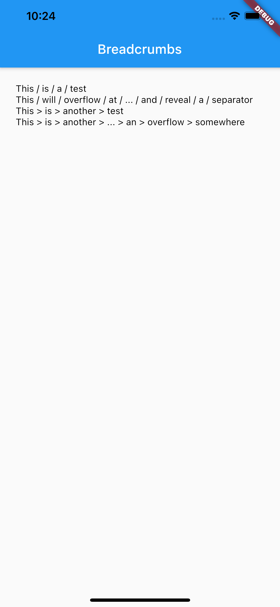

# Breadcrumbs

[](https://pub.dev/packages/lint)
[](https://pub.dartlang.org/packages/breadcrumbs)

Breadcrumbs with automatic overflow handling and high customisability.

## Example
```dart
import 'package:breadcrumbs/breadcrumbs.dart';
import 'package:flutter/material.dart';

void main() {
  runApp(BreadcrumbsApp());
}

class BreadcrumbsApp extends StatelessWidget {
  const BreadcrumbsApp({Key? key}) : super(key: key);

  @override
  Widget build(BuildContext context) {
    return MaterialApp(
      home: Scaffold(
        appBar: AppBar(
          title: Text('Breadcrumbs'),
        ),
        body: Padding(
          padding: EdgeInsets.all(24),
          child: Column(
            crossAxisAlignment: CrossAxisAlignment.start,
            children: [
              _buildBreadcrumb('This is a test'),
              _buildBreadcrumb(
                  'This will overflow at some point and reveal a separator'),
              Breadcrumbs(
                crumbs: [
                  TextSpan(text: 'This'),
                  TextSpan(text: 'is'),
                  TextSpan(text: 'another'),
                  TextSpan(text: 'test'),
                ],
                separator: ' > ',
                style: TextStyle(color: Colors.black),
              ),
              Breadcrumbs(
                crumbs: [
                  TextSpan(text: 'This'),
                  TextSpan(text: 'is'),
                  TextSpan(text: 'another'),
                  TextSpan(text: 'test'),
                  TextSpan(text: 'with'),
                  TextSpan(text: 'an'),
                  TextSpan(text: 'overflow'),
                  TextSpan(text: 'somewhere'),
                ],
                separator: ' > ',
                style: TextStyle(color: Colors.black),
              ),
            ],
          ),
        ),
      ),
    );
  }

  Widget _buildBreadcrumb(String text) {
    final list = text.split(' ');
    return Breadcrumbs.builder(
      itemCount: list.length,
      itemBuilder: (context, index) => TextSpan(
        text: list[index],
      ),
      style: TextStyle(color: Colors.black),
    );
  }
}
```

